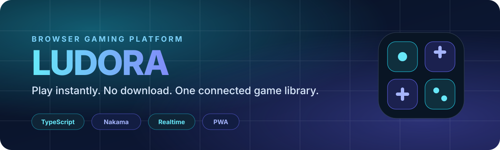

  

  <strong>A growing browser gaming platform built around instant play, shared progression and connected multiplayer.</strong>

  <a href="https://ludora.adrianguichard.dev/">Live product</a>
  ·
  <a href="https://adrianguichard.dev">Portfolio</a>
  ·
  <a href="https://github.com/Addey34">GitHub profile</a>

---

## 🎮 What is Ludora?

Ludora is a **browser-first gaming platform** designed to make a large catalogue of games feel like one coherent product rather than a collection of isolated pages.

Players can launch games instantly from the browser while the platform provides the shared layer around them: discovery, progression, saved results, profiles, leaderboards and multiplayer features.

The product is still evolving. This repository is intentionally a **public showcase only** — the production source code remains private.

---

## ✨ Product highlights

| | |
| --- | --- |
| ⚡ **Instant play** | Games launch directly in the browser with no installation step. |
| 🧩 **Shared platform layer** | One experience around discovery, profile, progression and saved results. |
| 🌍 **Online features** | Leaderboards, connected sessions and multiplayer capabilities through a self-hosted backend. |
| 📱 **Desktop + mobile** | Keyboard, mouse and touch depending on the game. |
| 🇫🇷 🇬🇧 **Bilingual** | Shared interface available in French and English. |
| 📴 **Graceful fallback** | Core gameplay remains usable when optional network services are unavailable. |

---

## 🧠 Engineering focus

Ludora is built around a reusable platform layer so each game can stay focused on its own gameplay while common concerns are handled once.

At a high level, the product combines:

- **TypeScript** for the application and game code;
- **Vite** for the multi-page browser application;
- **Canvas / browser rendering** for many game experiences;
- **Nakama** for online services such as authentication, storage, leaderboards and multiplayer;
- **PWA capabilities** for a more app-like browser experience;
- **CI quality gates** around formatting, linting, tests and production builds.

Implementation details, internal contracts and production architecture are deliberately not published in this showcase.

---

## 🏗️ Product philosophy

Ludora is built around three simple ideas:

1. **A game should start quickly.**
2. **The platform should connect games without making them dependent on the network.**
3. **Shared systems should be reusable instead of being rebuilt game by game.**

That means the valuable part of the project is not only the catalogue itself, but the engineering layer that lets many different games coexist under one product.

---

## 🚧 Current status

**Active development.**

The public version is already usable, while the platform, catalogue and connected features continue to evolve.

➡️ **Try Ludora:** https://ludora.adrianguichard.dev/

---

## 🔒 Source availability

This repository does **not** contain Ludora's production source code.

It exists only to present the product publicly without exposing proprietary implementation details, internal architecture, credentials, deployment configuration or private business logic.

---

## © Rights

**© 2026 Adrian Guichard. All rights reserved.**

This repository is a public product showcase for Ludora. The application source code is not distributed through this repository. No license is granted for reuse, redistribution or derivative works beyond the rights provided by applicable law and GitHub's platform terms.
